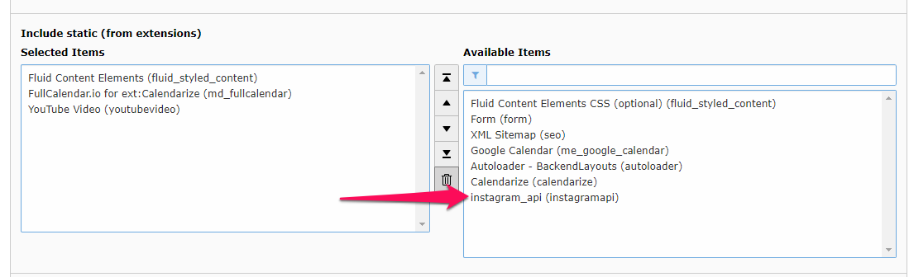
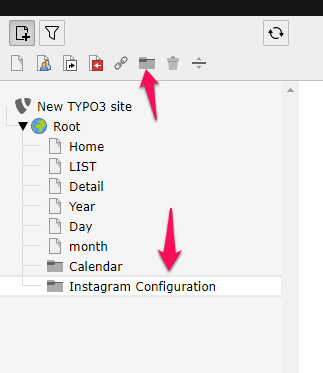
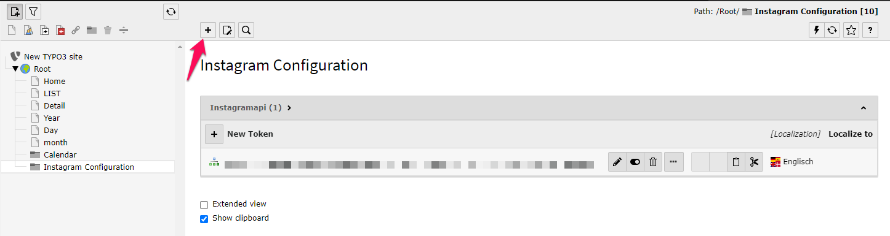
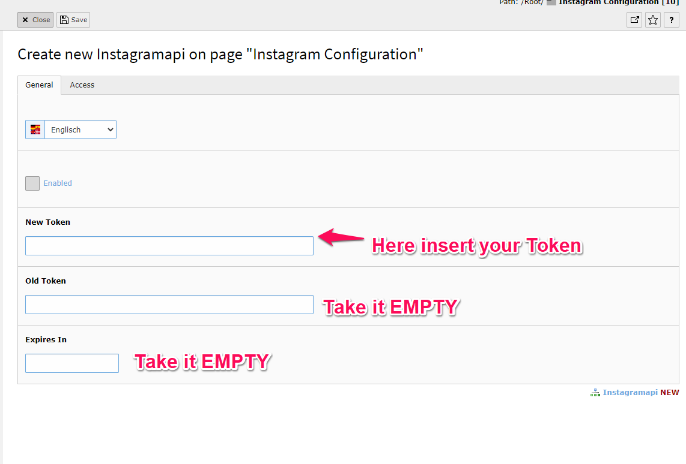
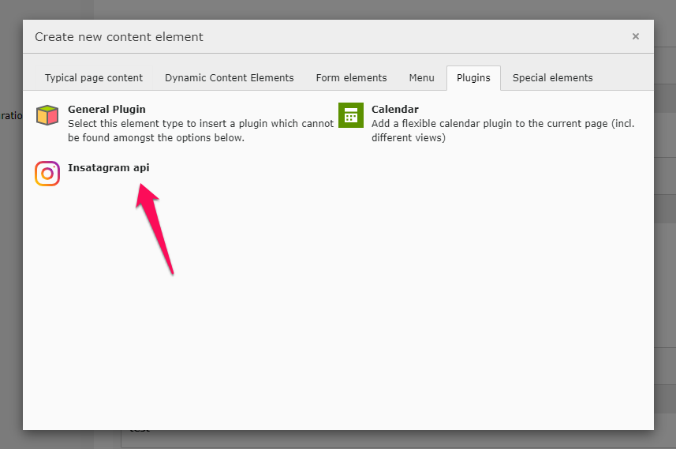
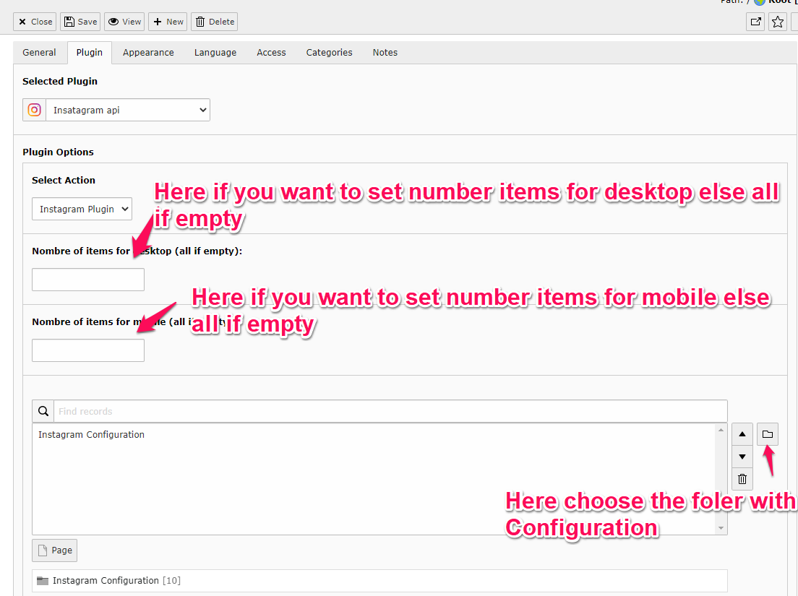
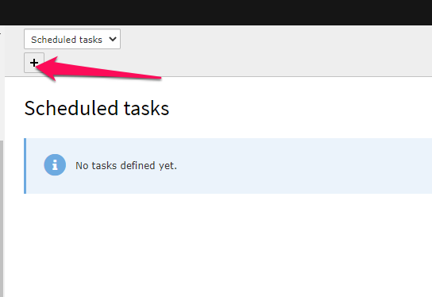
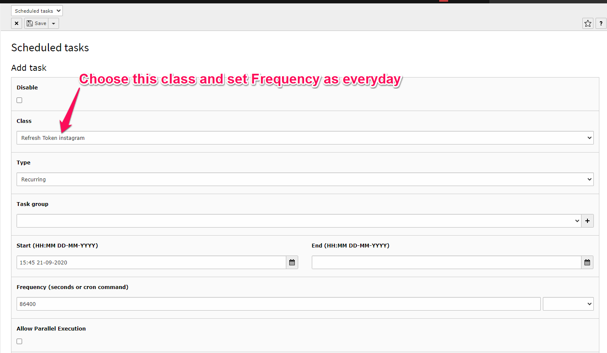

# TYPO3 Extendion ``instagramapi``

## 1 Description & Problem solved 
This Extension have a lot of function and option we can separate and the biggest problem that are solved is now we can generate Instagram token by  [Facebook developer](https://developers.facebook.com/) only for two month but with this ext the key will be generate auto by CRON Task

## 2 Features
* Render picture from instagram and show as beautify gallery
* Regenerate Token instagram for long time living 
* A new pagination gallery 

## 3 Usage 

### 3.1 Installation

#### Installation as extension from TYPO3 Extension Repository (TER)

Download and install the [extension][1] with the extension manager module.

### 3.2 Minimal setup

1) Include the static TypoScript of the extension.

2) Create new folder for configuration 

3) Now inside this folder create a new configuration with the token that are generated 

4) add plugin to show the gallery in FE 

5) Add a paginated gallery 

6) The Last Config now is for the CRON TASK to regenerate the token of instagram API from [Facebook developer](https://developers.facebook.com/)

## 4 Requirements

- TYPO3 >= 8.7

## Bugs and Known Issues
If you find a bug, it would be nice if you add an issue on [Github](https://github.com/taieb123/instagramapi/issues).

[1]: https://extensions.typo3.org/extension/instagramapi/